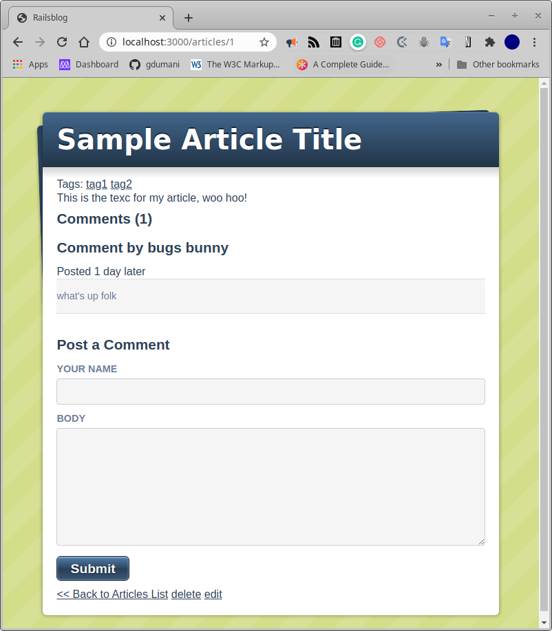

# railsblog
This is an implementation of the Rails blog that appears in the documetation to explore its features

## Built With
​
- Ruby 2.7.0
- Rais 6 
- SQL lite

## Requirements

The required gems are included in a Gemfile and can be installed with Bundler.

### Git
To download the sofware git is required
For instructions on how to install it, follow this link:

`https://github.com/git-guides/install-git`

### Ruby
To verify the ruby installation go to this link:
`https://www.ruby-lang.org/en/documentation/installation/`

### Rails
Follow the instruction on the following link to install rails:
`https://guides.rubyonrails.org/getting_started.html `

### Blog installation
This project followed the instructions from:
`http://tutorials.jumpstartlab.com/projects/blogger.html `

## Getting Started

​Get a local copy:​ 
In your selected directory type

`git clone https://github.com/gdumani/railsblog.git`

`cd railsblog`

In the covid scrapper directory install the required gems:

`bundle install` 

## Commands

`rails server`

## Intructions

open you browser and to to 

`localhost:3000`

## Screenshots

## Authors

👤 **Giancarlo Dumani**

- Github: [gdumani](https://github.com/gdumani)
- Twitter: [@gdumani1](https://twitter.com/gdumani1)
- Linkedin: [Giancarlo-Dumani](https://www.linkedin.com/in/giancarlo-dumani-a7364a1a1/?originalSubdomain=cr)

👤 **Miguel Uzcátegui**

Github: [@Miguelus373](https://github.com/Miguelus373)
- Linkedin: [Miguel-Uzcátegui](https://www.linkedin.com/in/miguelus/) 

## 🤝 Contributing

Contributions, issues and feature requests are welcome!

Feel free to check the [issues page](https://github.com/gdumani/railsblog/issues).

## Show your support

Give a ⭐️ if you like this project!

## Acknowledgments

- This project was part of Microverse's curriculum in Rails learning program.
- We followed the step y step guide of [Jumpstart Lab](http://tutorials.jumpstartlab.com/projects/blogger.html)

## 📝 License

​This project has MIT license.
